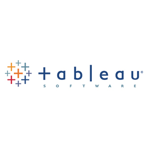
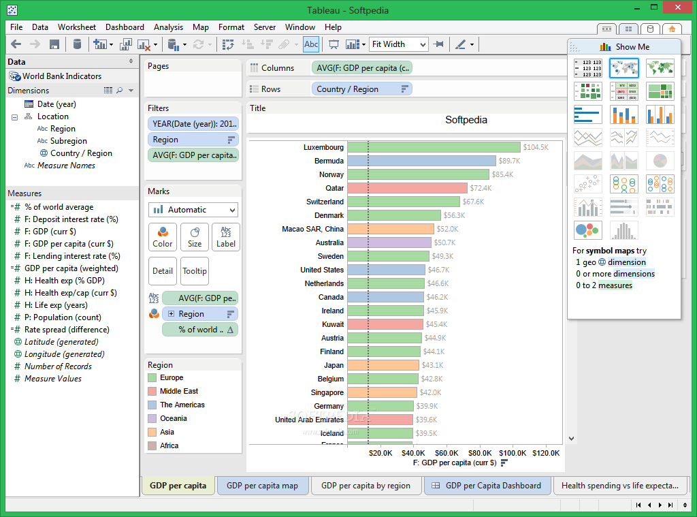
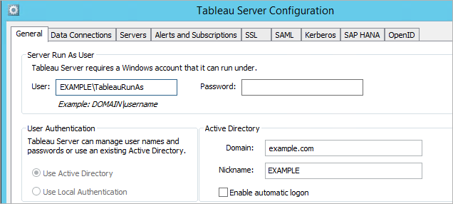
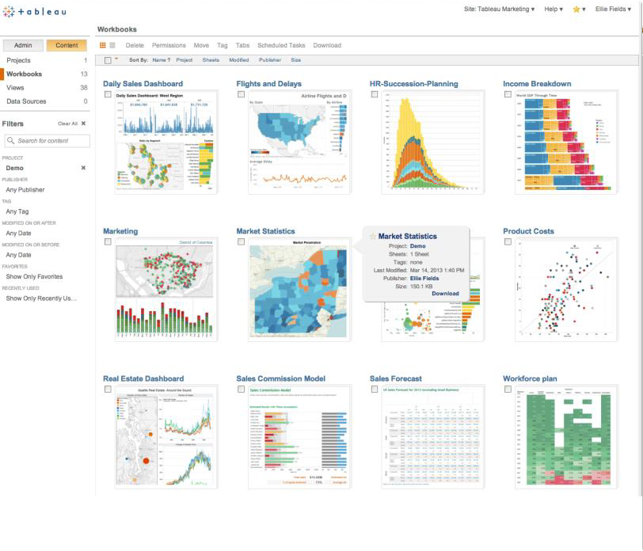
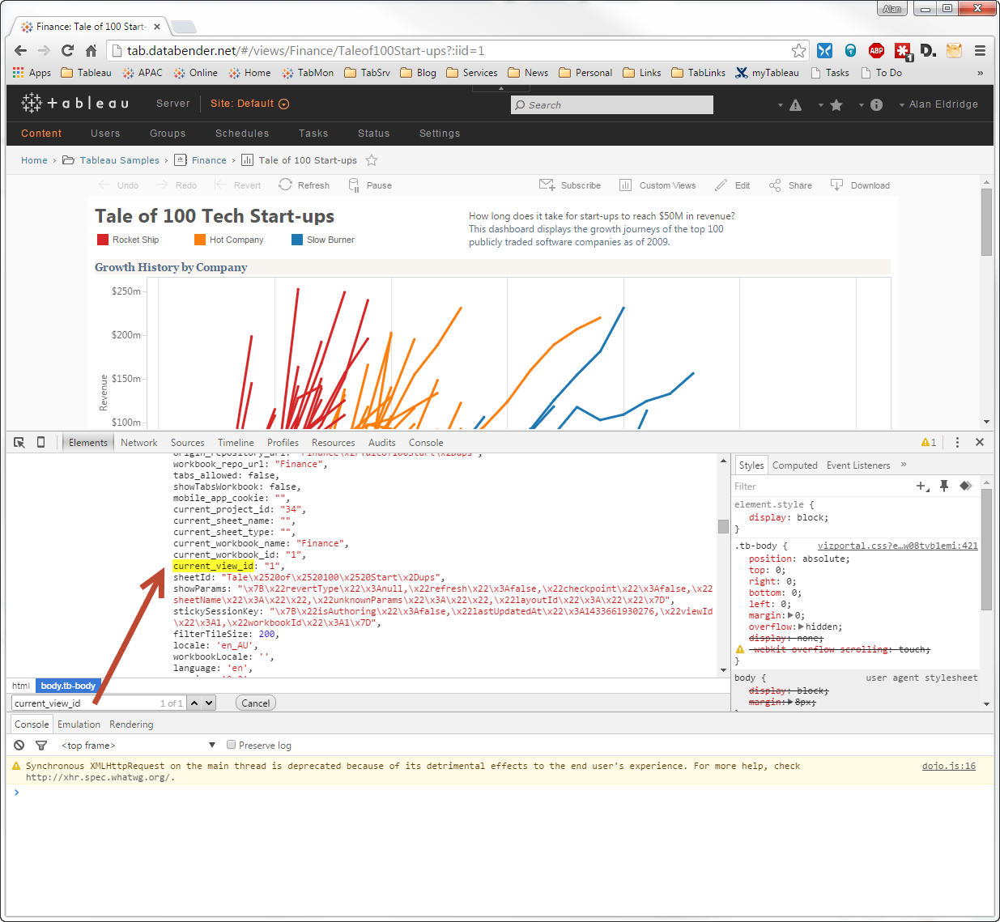
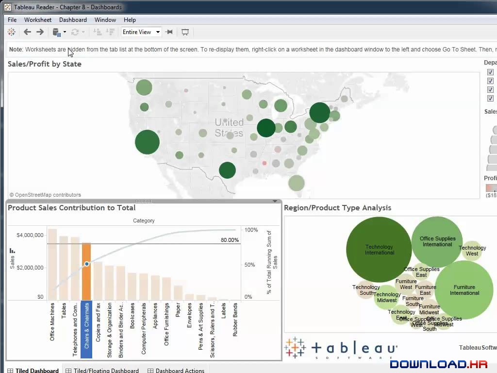
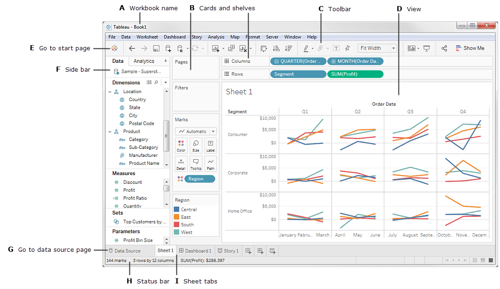
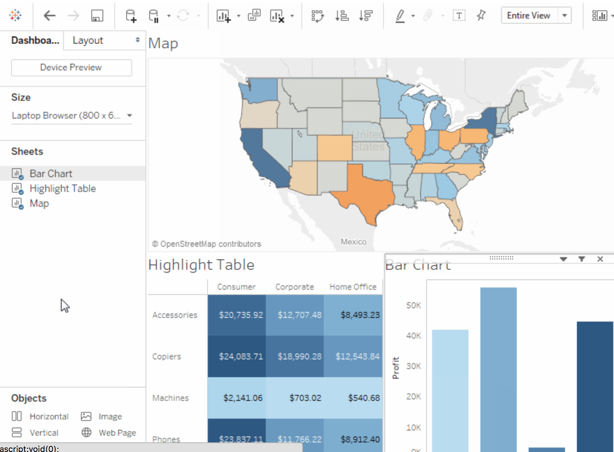
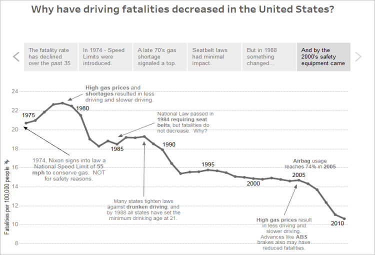

# CC-2018 - Data Visualization using Tableau - Research Project

* Segio J. Ruiz Sainz
* Dagoberto J. Herrera Murillo

Cloud Computing and Big Data Analytics

Dr. Angel Toribio-González

May 8th, 2018_

<p align="center">
  
</p>

## Index

1. [Introduction](https://github.com/sergiers3/CLOUD-COMPUTING-CLASS-2018/blob/master/Research-topic/Readme.md#introduction)
2. [Company Profile and History](https://github.com/sergiers3/CLOUD-COMPUTING-CLASS-2018/blob/master/Research-topic/Readme.md#company-profile-and-history)
3. [What is behind Tableau?](https://github.com/sergiers3/CLOUD-COMPUTING-CLASS-2018/blob/master/Research-topic/Readme.md#what-is-behind-tableau)
4. [Products](https://github.com/sergiers3/CLOUD-COMPUTING-CLASS-2018/blob/master/Research-topic/Readme.md#products)
5. [Working with Tableau](https://github.com/sergiers3/CLOUD-COMPUTING-CLASS-2018/blob/master/Research-topic/Readme.md#working-with-tableau)
6. [Comparison with Power BI](https://github.com/sergiers3/CLOUD-COMPUTING-CLASS-2018/blob/master/Research-topic/Readme.md#comparison-with-power-bi)
7. [Advanced features and tools for data science](https://github.com/sergiers3/CLOUD-COMPUTING-CLASS-2018/blob/master/Research-topic/Readme.md#advanced-features-and-tools-for-data-science)
8. [Resources to learn more](https://github.com/sergiers3/CLOUD-COMPUTING-CLASS-2018/blob/master/Research-topic/Readme.md#resources-to-learn-more)
9. [Conclusion, personal experience & learned lessons](https://github.com/sergiers3/CLOUD-COMPUTING-CLASS-2018/blob/master/Research-topic/Readme.md#Conclusion)
10. [References](https://github.com/sergiers3/CLOUD-COMPUTING-CLASS-2018/blob/master/Research-topic/Readme.md#references)


## Introduction

The Data Revolution is here. More data has been created in the past two years than in the entire previous history of the humanity. And this is not going to stop, by the year 2020 about 1.7MB of new information will be created every second for every human being on the planet [[1]](https://github.com/sergiers3/CLOUD-COMPUTING-CLASS-2018/blob/master/Research-topic/Readme.md#references). This large amount of data represents a new era of unprecedented new opportunities for the human advancement. The problem is that, while data grows at a gigantic pace, our ability to store, collect and calibrate these material increases at a much faster rate than the ability to analyze it.

In recent years, numerous automatic data processing techniques have been developed to assist people in the task of analyzing data. However, the complex nature of many real problems makes it essential to include human intelligence at the beginning of the chain of the data analysis process. This need to communicate the results has marked the emergence of Visual Analytics. Visual Analytics is the science of analytical reasoning, supported by interactive visual interfaces. These methods allow decision makers to combine their human flexibility, creativity and prior knowledge with the enormous storage and processing capabilities that today's computers offer. Using advanced visual interfaces, people can interact directly with the data analysis capabilities of current computers, allowing them to make well-informed decisions in complex and high-risk situations.[[2]](https://github.com/sergiers3/CLOUD-COMPUTING-CLASS-2018/blob/master/Research-topic/Readme.md#references)

Data discovery based on Visual Analytics, in the context of modern business intelligence platforms (Business Intelligence), started around 2004. Modern BI and analytics platforms are characterized by user friendly tools that support a full range of analysis in addition to continuous workflow capabilities and do not require significant IT involvement to predefine data models in advance as a prerequisite for the analysis.

When analyzing the offer of current solutions in the analytics and business intelligence platform market, Tableau has been positioned as a leader in data visualization for a long time. Tableau offers an exploration experience based on images, being a highly interactive and intuitive tool for business users to easily access, prepare and analyze their data without the need to code. Tableau works through three main products: Tableau Desktop, Tableau Server and Tableau Online (which is the Tableau cloud offer). Since its origins, Tableau has been focused on making the analytic workflow experience easier for its users, but at the same time, it gives analysts more power to explore and find information and knowledge in the data. Tableau achieved exponential growth and has disturbed the market by appealing to business buyers[[3]](https://github.com/sergiers3/CLOUD-COMPUTING-CLASS-2018/blob/master/Research-topic/Readme.md#references).

### Company Profile and History

Tableau Software is a company from the United States, based in Seattle, Washington, that produces interactive data visualization products focused on business intelligence. In its beginnings, it commercialized investigations that had been carried out in the Department of Sciences of the Computation of the University of Stanford. The products included relational databases, OLAP cubes, databases in the cloud and spreadsheets and then generates various types of graphics.[[4]](https://github.com/sergiers3/CLOUD-COMPUTING-CLASS-2018/blob/master/Research-topic/Readme.md#references)


The company was founded in the Department of Computer Science at Stanford University between 1997 and 2002 by Professor Pat Hanrahan and the PhD. Student Chris Stolte, who was specialized in visualization techniques to explore and analyze relational databases and data cubes. He led the research in the use of table-based screens to explore multidimensional relational databases. Both experts combined a structured query language for databases with a descriptive language to render graphics and invented a database visualization language called VizQL (Visual Query Language). VizQL formed the core of the Polaris system, an interface to explore large multidimensional databases. In 2003, after Stolte recruited his former business partner and friend, Christian Chabot, to serve as CEO, Tableau separated from Stanford with a software application of the same name. The product integrates relational databases, data cubes, databases in the cloud and spreadsheets and then generates various types of graphics that can be combined into panels and shared on a computer network or on the Internet.[[5]](https://github.com/sergiers3/CLOUD-COMPUTING-CLASS-2018/blob/master/Research-topic/Readme.md#references)


### What is behind Tableau?

VizQL and Hyper are the two innovative technologies that support the success of Tableau's data visualization platforms. VizQL is a formal language to describe tables, charts, graphs, maps, time series and visualization tables. It combines queries, data analysis and visualizations in a single frame. These different types of visual representations are unified in the same environment, which facilitates the change from one visual representation to another (for example, from a list view to a table of cross references to a table). Unlike graphics packages of current tools and query languages, VizQL allows an unlimited number of image expressions. The visualizations can be easily customized and controlled. Both the current and traditional query languages, such as SQL and MDX, have very limited formatting and visualization capabilities. Therefore, although quite powerful queries can be composed, another layer of software is needed to inform or present the results in a useful and user-friendly way to the analyst. VizQL is designed to fill that gap. VizQL allows a new generation of visual analysis tools that combine consultation, analysis and visualization [[6]](https://github.com/sergiers3/CLOUD-COMPUTING-CLASS-2018/blob/master/Research-topic/Readme.md#references).


Hyper is a high performance-memory data engine technology. With Hyper, transactions and analytic queries are processed in the same column store, without the need to reprocess again all the data once they have been obtained and imported. By doing this, the amount of useless data is reduced and the disconnection between specialized systems is reduced. Hyper's unique approach supports the combination of intense write and read workloads in the same system. As a result, it is possible to create extractions quickly and without sacrificing query performance[[7]](https://github.com/sergiers3/CLOUD-COMPUTING-CLASS-2018/blob/master/Research-topic/Readme.md#references).


### Products 

__Tableau Desktop__: Tableau desktop offers all the full features of its software. One of its main functions, the workbooks, can be shared locally. This version also allows the connection to different types of files, create extracts from data sources and save Tableau workbooks locally and publicly[[8]](https://github.com/sergiers3/CLOUD-COMPUTING-CLASS-2018/blob/master/Research-topic/Readme.md#references). It has the following characteristics:


* Self-service business analytics and data visualization platform.
* Translates pictures of data into optimized database queries.
* Connect directly to data from a data warehouse for live up to date data analysis.
* Perform queries without writing a single line of code.
* Import data into Tableau’s data engine from multiple sources and integrate.
* Combine multiple views into interactive dashboards.
* Highlight and filter data to show relationships.
* Advances in database and computer graphics technology make even huge data sets possible to analyze.
* Optimized color schemes, automatic chart types and elegant design are built in, so insight is automatically communicated in the most effective way.
* Makes data easily understandable for everyone so decisions can be driven by data.
* There is a Mac version available.

<p align="center">
  
</p>

```
Image 1. A worksheet in Tableau Desktop (Source: Tableau, 2017)
```

__Tableau Server__: Tableau Server allows users to save workbooks securely throughout the organization using a secure server. The user do not require infrastructure have to share the workbook publicly. However, this has an additional cost over the original price[[9]](https://github.com/sergiers3/CLOUD-COMPUTING-CLASS-2018/blob/master/Research-topic/Readme.md#references). It offers us these characteristics:


* Publish dashboards with Tableau Desktop and share them throughout the organization with web-based Tableau Server.
* Users can interact with dashboards using the browser or mobile-based devices.
* Leverages fast databases through live data connections, or can extract and refresh data.
* Empower business team to find answers in minutes, not weeks or months.

<p align="center">
  
</p>


<p align="center">
  
</p>

```
Image 2. Tableau Server User Interface (Source: Tableau, 2017)
```
There is a close relationship between Tableau Desktop and Server, they can work very well with each other. Tableau Server can be used to publish worksheets, dashboards and stories created using Tableau Desktop. Inversely, Tableau desktop users can use Tableau Server for accessing high-performance data repositories.

__Tableau Online__: This is a free version of the software that can allow anyone to connect to a spreadsheet or file and create interactive visualizations of data for the web[[10]](https://github.com/sergiers3/CLOUD-COMPUTING-CLASS-2018/blob/master/Research-topic/Readme.md#references). It offers the following characteristics:


* Hosted version of Tableau Server makes business intelligence faster and easier.
* Publish dashboards with Tableau Desktop and share them with colleagues, partners or customers.

<p align="center">
  
</p>

<p align="center">
  
</p>

```
Image 3. Tableau Online User Interface (Source: Tableau, 2017)
```

__Tableau Reader__: Tableau Reader allows users to read the Tableau file types. If someone wants to share workbook by sending a file, the receiver will need a Tableau reader to open the document. Without the reader, the user may need share it publicly or convert the workbook into a PDF format.[[11]](https://github.com/sergiers3/CLOUD-COMPUTING-CLASS-2018/blob/master/Research-topic/Readme.md#references) It offers the following characteristics:

<p align="center">
  
</p>

```
Image 4. Tableau Reader Interface (Source: Tableau, 2017)
```

* Free desktop application that enables users to open and view visualizations built in Tableau Desktop
* Users can filter, drill-down and view details of the data but the receiver won’t be able to edit or perform any interactions if the author hasn’t built it[[12]](https://github.com/sergiers3/CLOUD-COMPUTING-CLASS-2018/blob/master/Research-topic/Readme.md#references)
 


### Working with Tableau

Tableau uses a workbook and a sheet file structure, much like Microsoft Excel. A workbook is made up of sheets, and a sheet can be a worksheet, a dashboard or a story [[13]](https://github.com/sergiers3/CLOUD-COMPUTING-CLASS-2018/blob/master/Research-topic/Readme.md#references).


* A worksheet contains only one view along with shelves, cards, legends and the Data and Analysis panels in its sidebar.

<p align="center">
  
</p>

```
Image 5. A worksheet is a single view with data and analytics panes, shelves, cards, legends. (Source: Tableau, 2017)
```
Tableau can connect to a wide variety of popular and widely used data sources and the list grows continuously. Tableau’s connectors can connect to file systems (CSV and Excel), relational systems (Oracle, Sql Server or DB2), cloud systems (Amanzon, Windows Azure or Google BigQuery) or other sources (ODBC). Multiple data sources can be modeled in the same workbook.

When a data source is connected with Tableau, the software automatically classifies each field as a measure or a dimension. A measure is a field that represents a dependent variable, any field containing quantitative information is treated as a measure. While dimension is an independent variable. By default, any field containing categorical information is treated as a dimension.

The dimensions may contain hierarchies. These hierarchies can be navigated through drill down or drill up functions. For example, if it is required to examine the total sales for various years, using drill down, sales for all the months within each year are displayed. Conversely, if it is required to examine the total sales for all months, with drill up the sales for each year are displayed.

* A dashboard consists of a collection of several worksheets and supporting information that are displayed in one place so it is possible to compare and monitor a variety of data at the same time. For example, if a set of views are reviewed every day, instead of flipping through each worksheet, a panel can be created to shows all views together.

<p align="center">
  
</p>

```
Image 6. A dashboard is a collection of views with dashboard and lat panes in its side bar.  (Source: Tableau, 2017)
```

* A story is a sequence of visualizations that work together to convey a message. Stories can be created to communicate a data narrative, improve context, prove how decisions relate to results, or simply generate a compeling case. A story is a sheet, so the methods used to create, name, and manage panels and worksheets also apply to these stories. At the same time, a story can be conceptualized a list of leaves, organized in a sequence. Each individual sheet in a story defines a story point. When a story is shared, for example, by publishing a workbook in Tableau Public, Tableau Server, or Tableau Online, viewers of the tool can interact with the story to reveal new findings or ask new questions about the data.


<p align="center">
  
</p>

```
Image 7. A story contains worksheets or dashboards that work together to convey information. (Source: Tableau, 2017)
```

### Advanced features and tools for Data Science

Tableau's developer tools and APIs allow to extend, customize and automate the capabilities of the platform to fit specific needs:

__Extensions:__ web applications that can interact and communicate with Tableau. Tableau Extensions API SDK can be accessed in two ways. Clone the repository to the open source project or keep current with the latest changes. 
When a Tableau Extension is installed, it can used like any other dashboard object. 

__Data connectivity:__ create connectors to data sources that are not currently supported by Tableau, including websites and custom applications.

__Automation:__ automate tedious tasks and programmatically manage Tableau Server content. It includes programmatic access to work with content, users, sites, and customized scripts that pull data into Tableau data extracts.

__Data science integration:__ Tableau’s integration with R, Python and MATLAB offers the possibility to work with complex statistical models.

__Embedded analytics:__ it is possible to Embed visualizations into other business applications like Salesforce and Sharepoint.

In addition, in the context of the implementation of Big Data projects, there are several alternatives to reach a visualization layer, passing through a cluster and its components for storing and processing. A popular approach to implement a Big Data solution is the use of Spark for processing in Hadoop consuming clusters data from storage systems such as HDFS or Hbase. Then it is possible to use specific connectors to access Tableau where the results are analyzed in an easy and business-friendly way.[[14]](https://github.com/sergiers3/CLOUD-COMPUTING-CLASS-2018/blob/master/Research-topic/Readme.md#references)

### Comparison with Power BI

<p align="center">
  
</p>

So far we have talked about Tableau. But what about other similar tools in the market? The direct competition of Tableau would be Power BI. According to Gartner (2017),[[15]](https://github.com/sergiers3/CLOUD-COMPUTING-CLASS-2018/blob/master/Research-topic/Readme.md#references). Tableau and Microsoft Power BI are the two front-runners in the business intelligence (BI) and data visualization software industry. Tableau remains to be perceived as the modern Business Intelligence market leader — still slightly ahead of Power BI (Microsoft) in terms of overall execution. While improvement continues for Tableau, it is at a much modest pace due to pricing and competitive pressure coming from Microsoft. We've analyzed multiple reviews that compare Tableau and Power BI to highlight main differences and the factors to consider in a purchase decision. Most of these reviews share a number of common aspects.[[16]](https://github.com/sergiers3/CLOUD-COMPUTING-CLASS-2018/blob/master/Research-topic/Readme.md#references)

__Pricing:__ When it comes to cost, Power BI is generally a more affordable option. For clients who prefer free trial alternatives, Power BI offers a 60 day Pro trial, while Tableau offers a 14 day free trial. Moreover, Power BI starts at $9.99 per user per month, while Tableau starts at $35.

__Functionality:__ The depth of data discovery is more sophisticated with Tableau than Power BI. Both Tableau and Power BI allow business users to set up sophisticated visualizations that help identify patterns, reduce waste, speed up decision making and promote consensus. However, Tableau allows users to leverage any number of data points for carrying out analysis – a capability that Power BI doesn’t provide. Both Tableau and Power BI offer support for multiple data connectors including online analytical processing and big data options ( NoSQL and Hadoop) as well as cloud services. But, Tableau offers improved support for connecting to a distinct data warehouse, whereas Power BI is highly dependent on Microsoft’s portfolio, including its Azure cloud infrastructure.

__Product support and community:__ While both products offer extensive digital resources and training for users to self-serve, Tableau provides more comprehensive customer support alternatives in terms of direct contact. Power BI clients with free accounts have restricted support, while users with Pro and Premium accounts receive consistent and faster answers. With Tableau, clients can access support and training resources tailored to their version of the product, including getting started session, best practices manuals and how to optimally use the platform’s advanced features. Clients can also visit the Tableau community forum and participate in training activities and other events. Power BI also provides solid support resources and documentation, including a growing user community forum, guided learning, and multiple samples of how partners use the platform to generate value.

### Resources to learn more

Some interesting resources, closely related to Tableau, can be visited to get an idea of the potential of this tool. The first place we recommend to visit is [its public repository](https://www.tableau.com/es-es/support/public), where we can find thousands of examples of how to create extensions that expand the capacity of Tableu as a data visualization tool.

After more than ten years of activity, Tableau has managed to gather a very active and large user community, whose knowledge is shared through its [own Stack Exchange](https://community.tableau.com/welcome), where we can find thousands of questions answered by the community, both basic and more advanced

Finally, if you are already a medium-advanced user of this tool, we think that the [official Tableau repository](https://github.com/tableau) is an ideal place to continue developing your skills in Data Visualization.

### Conclusion, personal experience & learned lessons

This report analyzed Tableau, a leading Business Intelligence tool that focuses on data visualization, data discovery and dashboarding.
A series of features that have been especially appreciated by business users who do not have programming skills. Tableau Desktop, Tableau Server and Tableau Online are the star products.

Tableau is a well-known tool. In our personal case, both team members had used this tool in the past. For the purposes of this work, we installed Tableau again. From our perspective, little can criticize this application in terms of functionality. We find it very easy to use, producing results of a very professional aesthetic. Regarding the negative part of this tool, we must recognize that it is expensive. Even so, we can install it using a student license. If the budget is the determining factor when choosing a data visualization tool, Tableau ceases to be an attractive alternative.

You can always learn something new. We were greatly surprised by the fact that the platform has incorporated more advanced statistical functions for data analysis (forecasts, clusters, confidence intervals, quartiles), which can reveal insights that can not be discovered at a glance. We also think it is very positive that Tableau can connect relatively easily to programming languages such as R and Python, which makes it a perfectly functional tool in the field of data science projects.

In the previous occasions in which we used this tool, we did it from a business user's perspective, whereas in this opportunity, we gave it time to explore the Tableau Developer Tools, which allow us to extend the basic functionalities and connect to other data sources.


## References:

[1] [Forbes, 2017, How To Stay Sane And Spur Sales In Data Wonderland](https://www.forbes.com/sites/falonfatemi/2017/06/27/how-to-stay-sane-and-spur-sales-in-data-wonderland/#2709d6d2f88f).

[2] Thomas, J., Cook, K.: Illuminating the Path: Research and Development Agenda for Visual Analytics. IEEE-Press (2005)

[3] [Magic Quadrant for Business Intelligence and Analytics Platforms](https://cdn2.hubspot.net/hubfs/2172371/Q1%202017%20Gartner.pdf?t=149626062)

[4] [Tableau Software Inc, 2017](http://www.annualreports.com/Company/tableau-software-inc)

[5] [Tableau, Our Story, 2017](https://careers.tableau.com/ourstory)

[6] [what-is-vizql, bibuddy](https://bibuddy.wordpress.com/2017/04/11/what-is-vizql/)

[7] [Tecnología de Tableau, Tableau, 2017](https://www.tableau.com/es-es/products/technology)

[8] [Tableau corporate, Chris Raby, 2017](https://www.slideshare.net/chrisraby/tableau-corporate-16363769)

[9] [Tableau corporate, Chris Raby, 2017](https://www.slideshare.net/chrisraby/tableau-corporate-16363769)

[10] [Tableau corporate, Chris Raby, 2017](https://www.slideshare.net/chrisraby/tableau-corporate-16363769)

[11] [Tableau corporate, Chris Raby, 2017](https://www.slideshare.net/chrisraby/tableau-corporate-16363769)

[12] [Power BI vs Tableau, 2017](https://www.encorebusiness.com/blog/power-bi-vs-tableau/)

[13] [Workbooks and Sheets, Tableau, 2017](https://onlinehelp.tableau.com/current/pro/desktop/en-us/environ_workbooksandsheets.html)

[14] [clearpeaks, 2017, Big Data Ecosystem – Spark and Tableau](https://www.clearpeaks.com/big-data-ecosystem-spark-and-tableau/)

[15] [Gartner, 2017, Magic Quadrant for Business Intelligence and Analytics Platforms](https://cdn2.hubspot.net/hubfs/2172371/Q1%202017%20Gartner.pdf?t=149626062)

[16] [Better Buys, 2018, Tableau vs Power BI: Comparing Pricing, Functionality and Support](https://www.betterbuys.com/bi/tableau-vs-power-bi/)


